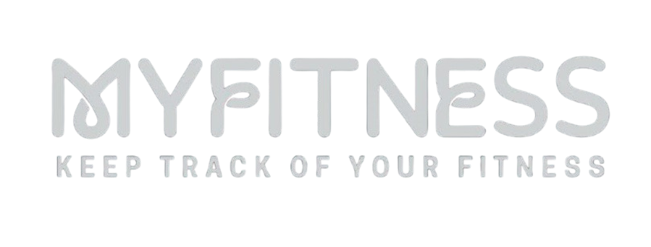

# MyFitness



MyFitness is a Flutter-based fitness tracking application designed to help users manage their fitness activities, track their workouts, and stay motivated. The app leverages Firebase for authentication and 
data storage, providing a seamless user experience.

#Screenshots from the application

## Features

- **User Authentication**: Secure login and signup functionality using Firebase Authentication.
- **Activity Tracking**: Log workouts and activities, including calories burned, duration, and activity type.
- **Statistics**: Visualize fitness progress over time with stats and records.
- **User Profile**: Manage user information and update profile images.
- **Bottom Navigation**: Easy navigation between Home, Records, Stats, and Profile pages.
- **Responsive Design**: Optimized for both Android and iOS devices.

## Tech Stack

- **Flutter**: Framework for building natively compiled applications.
- **Firebase**: Backend service for user authentication and data storage.
- **Cloud Firestore**: NoSQL database for storing user activity data.
- **Provider**: State management solution for managing app state.

## Getting Started

### Prerequisites

- Flutter SDK
- Dart SDK
- Firebase Project (with Firestore and Authentication enabled)

### Installation

1. Clone the repository:

   ```bash
   git clone https://github.com/yourusername/myfitness.git
Navigate to the project directory:

bash
Copy code
cd myfitness
Install the dependencies:

bash
Copy code
flutter pub get
Set up Firebase:

Create a Firebase project and add an Android/iOS app.
Download the google-services.json or GoogleService-Info.plist file and place it in the respective directory.
Configure Firebase for your project.
Run the app:

bash
Copy code
flutter run
Usage
Open the app and create a new account or log in if you already have one.
Navigate through the app using the bottom navigation bar.
Log your activities, view statistics, and manage your profile.
Contributing
Contributions are welcome! Please open an issue or submit a pull request if you have suggestions or improvements.

License
This project is licensed under the MIT License. See the LICENSE file for more details.

vbnet
Copy code

### How to Customize
- Replace `yourusername` in the GitHub clone URL with your actual GitHub username.
- Add any additional features or instructions specific to your app.
- Make sure to provide clear instructions for setting up Firebase, as it can be a bit tricky for new users.