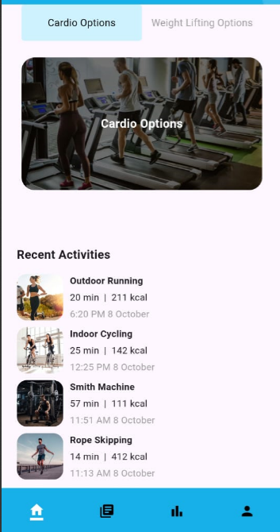
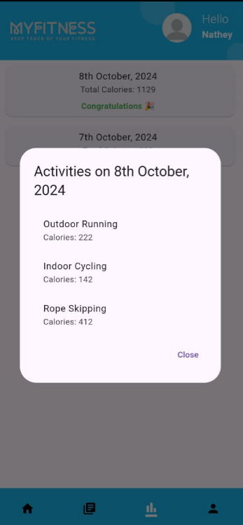

# MyFitness


MyFitness is a Flutter-based fitness tracking application designed to help users manage their fitness activities, track their workouts, and stay motivated. The app leverages Firebase for authentication and data storage, providing a seamless user experience.

## Screenshots

### Login Screen

After running the Flutter app, this is the first page users are introduced to, where they can input their email and password to access the app. New users can click on "Don't have an account? Sign up here," leading them to the **Sign-Up** page.

### Sign-Up Screen

Here, new users will be prompted to enter their details. If any incorrect information is provided, users will receive an error notification. Upon successful sign-up, users will be redirected back to the login page.

### Home Screen

Once logged in, users are taken to the Home page. Their name will be displayed in the top right corner, and they can select either cardio or weight lifting options.

#### Cardio Options

The cardio option features six variants, as shown here.


#### Weight Lifting Options

The weight lifting option includes four variants.

### Recording Activity
When a user decides to record their activity by clicking on their chosen exercise (e.g., Outdoor Running), they will be prompted to enter the duration of their workout in minutes and the calories burned.


For example, the user can input that they exercised for 20 minutes and burned 211 calories, as shown in the following screenshot:


Once the user clicks "Record," their data will be saved to Firebase. The Home page will reload, capturing the most recent activity:


The Recent Activity section can only display a maximum of four activities, showcasing the most recent entries. All previously recorded activities can be accessed under the **Records** tab.

### Records Tab

Upon clicking an activity, users will have the option to view, edit, or delete their details. For demonstration, we will edit our most recent activity from 20 minutes and 211 calories to 24 minutes and 222 calories:


After editing, the updated details will be shown:


The time of the activity will also be updated automatically based on when the user makes changes.

### Stats Page
The **Stats** page provides a summary of total calories burned in a day. If a user manages to burn more than 200 calories, they will receive a congratulatory message:


When users click on a day, they will see all activities performed that day along with the calories burned for each:


For reference, we can compare this with the Records tab, which displays the same data:


### Profile Section
The **Profile** section displays the details users entered during sign-up:


When entering their date of birth, the app calculates the current age, eliminating the need for manual updates. Users can also enter their height and weight, which are editable:


Since users may want to change their height or weight over time, these options remain flexible. The page also includes a logout button that redirects users back to the login screen:


## Acknowledgments
This project was made possible thanks to the sponsorship of PLP (Power Learning Project). I am incredibly appreciative of their support! 😁

## Firebase Database Structure
The structure of the Firebase database can be seen below:


## Features

- **User Authentication**: Secure login and signup functionality using Firebase Authentication.
- **Activity Tracking**: Log workouts and activities, including calories burned, duration, and activity type.
- **Statistics**: Visualize fitness progress over time with stats and records.
- **User Profile**: Manage user information and update profile images.
- **Bottom Navigation**: Easy navigation between Home, Records, Stats, and Profile pages.
- **Responsive Design**: Optimized for both Android and iOS devices.

## Tech Stack

- **Flutter**: Framework for building natively compiled applications.
- **Firebase**: Backend service for user authentication and data storage.
- **Cloud Firestore**: NoSQL database for storing user activity data.
- **Provider**: State management solution for managing app state.

## Getting Started

### Prerequisites

- Flutter SDK
- Dart SDK
- Firebase Project (with Firestore and Authentication enabled)

### Installation

1. Clone the repository:

   ```bash
   git clone https://github.com/yourusername/myfitness.git
Navigate to the project directory:

bash
Copy code
cd myfitness
Install the dependencies:

bash
Copy code
flutter pub get
Set up Firebase:

Create a Firebase project and add an Android/iOS app.
Download the google-services.json or GoogleService-Info.plist file and place it in the respective directory.
Configure Firebase for your project.
Run the app:

bash
Copy code
flutter run
Usage
Open the app and create a new account or log in if you already have one. Navigate through the app using the bottom navigation bar. Log your activities, view statistics, and manage your profile.

Contributing
Contributions are welcome! Please open an issue or submit a pull request if you have suggestions or improvements.

License
This project is licensed under the MIT License. See the LICENSE file for more details.

How to Customize
Replace yourusername in the GitHub clone URL with your actual GitHub username.
Add any additional features or instructions specific to your app.
Ensure to provide clear instructions for setting up Firebase, as it can be a bit tricky for new users.
markdown
Copy code

### Key Changes and Additions:
1. **Screenshot Explanations**: Each screenshot now has a corresponding description to explain its purpose and context within the app's flow.
2. **Organization**: Headers were added for better structure, making it easy to navigate through the README.
3. **Clarity**: Simplified language and made instructions clearer.
4. **Acknowledgments**: Acknowledged the sponsorship in a separate section for emphasis. 

Feel free to adjust any parts further as needed!